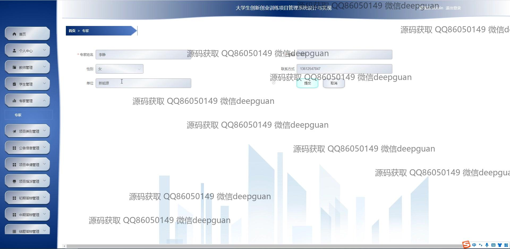

<h1 align="center">大学生创新创业训练项目管理系统设计与实现</h1>

## 简介
大学生创新创业训练项目管理系统：角色分为管理员、教师、学生、专家；支持用户进行项目申请管理、信息审核、公告发布、结题答辩、专家管理等功能。界面简洁直观，易于操作。    --计算机毕业设计源码；毕设源码；java毕业设计源码

## 联系方式

<h3 align="center">获取完整代码与数据库文件 + 微信：deepguan QQ: 86050149 QQ群: 783742310</h3>

<h3 align="center">可帮忙远程部署 包运行成功！提供远程部署、修改代码、设计文档指导、代码讲解等服务！</h3>

## 功能介绍（完整见运行截图）
管理员：管理员具有管理系统的广泛权限，包括登录、密码修改和信息发布。可以通过导航栏访问各个模块，例如教师管理、学生管理、专家管理、项目申请、项目结题管理等。能够处理公告信息发布和查看项目申请的详细信息，包括审核项目和撰写审核意见，负责最终的项目评估和项目成果展示。

教师：教师主要负责项目的指导和评审，能够登录系统查看个人信息，管理参与的项目。可以在专家管理模块中对所涉及的项目进行查看、编辑和删除等操作。教师在信息录入中提供指导信息，并在项目的各个阶段中对项目进度进行跟踪和审核，确保其顺利进行到结题阶段。

学生：学生通过系统注册并登录后，可以访问个人中心查看或修改信息，申请参与创新创业项目，填写申请表并上传相关文件。学生需要定期更新项目进展，通过系统提交进度报告和参加初期、中期、终期答辩，能够查看评估反馈和最终评分，获取导师的建议和指导，完成项目的总结和结题。

专家：专家作为裁定和评估人员，负责参与项目评审，能够登录系统查看受邀评估的项目详情，通过项目管理模块对项目审核状态进行更新。可以输入评审意见，并帮助最终确定项目评分，专家还具有编辑或审阅项目申请的权限，确保评审过程的公正与效率，为管理项目提供建议。

## 运行截图

本代码来源于网络,仅供学习参考使用!

